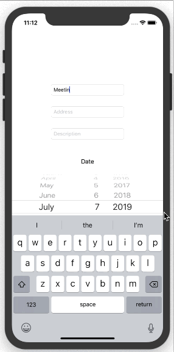

ToDoTDD
==========
TodoTDD is a simple to do list iOS App. It demonstrates how to write unit / UI tests for UI components, network layer, data serizalization, and etc. by following the test driven development process. The code test coverage is 91.9%.

## Screenshots

